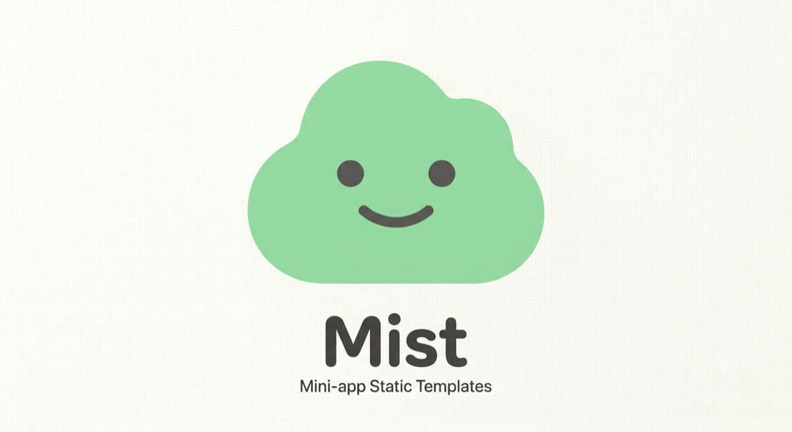
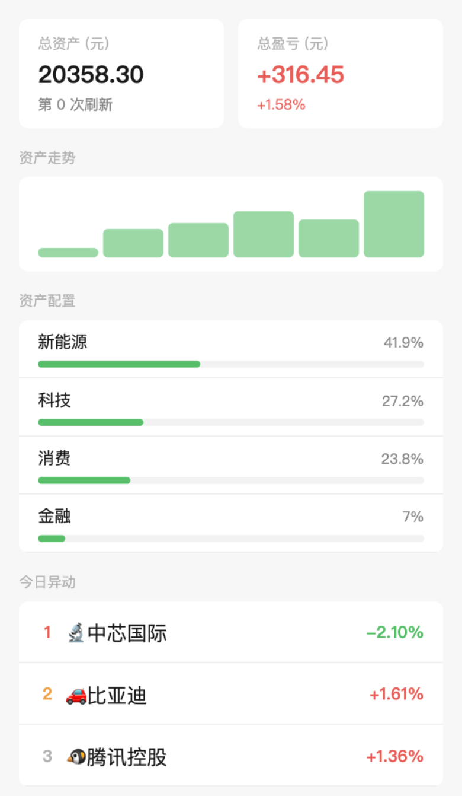

<p align="center">
  
</p>

<p align="center">
  <b>A component language and compiler for WeChat Mini Programs — like Svelte, for WeChat.</b><br />
  Astro-flavored single-file components, compiled by Rust to native mini-program code with near-hand-written performance.
</p>

<p align="center">
  <a href="https://github.com/TadejPolajnar/mist/actions/workflows/ci.yml"></a>
  <a href="https://www.npmjs.com/package/mist-lang"></a>
  <a href="LICENSE"></a>
</p>

<p align="center">
  <a href="docs/README.md">Getting started</a> ·
  <a href="docs/language.md">Language guide</a> ·
  <a href="docs/api.md">API</a> ·
  <a href="docs/testing.md">Testing</a> ·
  <a href="docs/diagnostics.md">Diagnostics</a> ·
  <a href="README.zh-CN.md">中文说明</a>
</p>

---

Write single-file `.mist` components (TypeScript frontmatter + JSX-ish template + Tailwind), get plain `Page()`/`Component()` mini-program code with **path-precise `setData`**: the compiler statically tracks every state mutation and emits the exact data path it changes. No virtual DOM, no runtime tree diffing, a ~10 KB runtime (3.2 KB gzipped).

```
┌──────────────┐     mistc (Rust)      ┌──────────────────────────────┐
│  .mist files  │ ───────────────────► │  WXML + WXSS + JS + JSON     │
│  stores/*.ts  │   oxc · tailwind v4  │  (WeChat DevTools-ready)     │
└──────────────┘                       └──────────────────────────────┘
```

**Measured** ([benchmark/](benchmark/)): toggling one row in a 1000-row filtered list sends **26 bytes** — within a small constant of the hand-written setData floor (guarded by `tests/bench.rs`) — across the setData bridge in exactly one batched call — ~2000× less than the naive full-resend pattern (Node harness: 49 B vs 96.6 KB). Head-to-head against Taro 3 + React in real WeChat DevTools ([benchmark/devtools/](benchmark/devtools/)): **~2.4× faster per interaction**, **2.6× less bridge traffic per toggle**, and a **29× smaller package** (10.7 KB vs 309.8 KB raw; 4.3 KB vs 86.9 KB gzipped — mist unminified, Taro a production webpack build).

## Install

```sh
npm install -g mist-lang     # prebuilt binaries for macOS / Linux / Windows
mistc --version
```

Or from source: `cargo install --path .` in a clone of this repo (Rust 2021).
Either way you also need **Node.js + npm** on PATH (Tailwind runs through the
real `@tailwindcss/cli`) and **WeChat DevTools** to run the output.

```sh
mistc init my-app            # scaffold: app.mist + a todo page + DevTools config
cd my-app
mistc build src --watch      # rebuild on save · import my-app/ in WeChat DevTools
```

## A taste

```jsx
---
import TodoItem from '../components/TodoItem.mist'
import { stats, track } from '../stores/stats.ts'
import { state, derived } from 'mist'

export const config = { navigationBarTitleText: 'Todos' }

const filter = state('all')
const todos = state([{ id: 1, title: 'Ship it', done: false }])

const visible = derived(() =>
  filter.value === 'all' ? todos.value : todos.value.filter(t => !t.done)
)

function toggle(id) {
  const i = todos.value.findIndex(t => t.id === id)
  todos.value[i].done = !todos.value[i].done   // → setData({`todos[${i}].done`: …})
  track('toggle')                              // shared store, updates every open page
}
---
<div class="p-4 flex flex-col gap-2">
  <span class="text-2xl font-bold text-blue-600">Todos ({visible.value.length})</span>
  {visible.value.map(t => (
    <TodoItem key={t.id} todo={t} onToggle={toggle} />
  ))}
  {visible.value.length === 0 && <span class="text-gray-400">Nothing here</span>}
  <button class="rounded-full bg-blue-500 text-white" onTap={() => filter.value = 'open'}>
    Only open
  </button>
</div>
```

## Example apps

| [雾茶 · food ordering](examples/food) | [雾投 · portfolio](examples/portfolio) | [雾板 · kanban](examples/kanban) |
|:---:|:---:|:---:|
|  |  |  |
| persisted cart + orders, checkout subpackage, tab icons, `migrate` | 13-node derived graph, keyed diffing, deterministic ticks | keyed reorders, cross-store deriveds, WIP limits |

Each ships a README, a gate test suite, and a DevTools-ready `project.config.json`.

## Working on the compiler

```sh
git clone https://github.com/TadejPolajnar/mist.git && cd mist
cargo run -- build examples/project/src -o dist   # compile the smallest example
# WeChat DevTools: Import Project → THIS repo folder (miniprogramRoot: dist/)

cargo test              # full suite (spawns node + npm)
node benchmark/bench.js # bridge-traffic benchmark
cargo install --path crates/mistc-lsp   # LSP for editors/vscode
```

### CLI

```
mistc init <name>                                        # scaffold a new project
mistc build <src-dir | entry.mist> [-o <outdir>] [--app] [--watch]   # -o defaults to dist/
```

- **`init`** → creates `<name>/` with `src/app.mist`, a todo page, `project.config.json` (DevTools-ready), `.gitignore`, and editor typing (`mist.d.ts`, `tsconfig.json`, `package.json` with `miniprogram-api-typings`).
- **Directory** → project build: requires `<dir>/app.mist` + `<dir>/pages/*.mist`; emits the WeChat layout (`pages/<n>/<n>.*`, `components/<k>/<k>.*`, `stores/*.js`, `app.json` with the page list, index first).
- **File** → single-entry build, flat output; `--app` adds a minimal DevTools-openable shell.
- **`--watch`** → rebuilds on every `.mist`/`.ts` save (debounced; output dir excluded).
- Warnings (`M1002` unknown class, `M1006` unsupported selector, `M1008` keyless list, `M1012` unhandled config) go to stderr; errors carry `M`-codes with `.mist` line:col and fix-it hints.
- `mistc --help` / `mistc --version` do what you expect.

## Project layout

```
src/
├── app.mist              # App lifecycle (onLaunch) + global config + global <style>
├── pages/
│   └── index.mist        # pages — index becomes the launch page
├── components/
│   └── TodoItem.mist     # PascalCase filenames → kebab-case components
└── stores/
    └── stats.ts          # shared reactive state (plain TS)
```

## Language tour

**Files** are three sections: `---` TypeScript frontmatter `---`, a template, and an optional `<style>` (→ WXSS).

**Reactivity** — everything is statically analyzable, and that's the point:

| You write | Compiler emits |
|---|---|
| `const n = state(0)` | key in `data` |
| `n.value++` | `this.__set('n', this.data.n + 1)` |
| `todos.value[i].done = x` | `` this.__set(`todos[${i}].done`, x) `` |
| `todos.value.push(t)` | length-indexed path write |
| `todos.value.splice(...)` | **compile error M1004** (`help: reassign`) |
| `const v = derived(() => …)` | recomputed once per batch; keyed lists diff per *field* |
| state the template never reads | never enters `data` at all — zero bridge cost (dead-data elimination) |
| `<input value:bind={text} />` | native `model:value` + generated sync handler |
| `{fmt(total.value)}` in a template | hoisted into a generated derived; per-item inside loops |

All writes in one event tick merge into **one** `setData`. Derived arrays rendered with `key={...}` get a keyed shallow diff — an in-place item change emits `visible[3]`, not the array.

**Templates** — web-familiar tags map to native ones (`div`→`view`, `span`→`text`, `img`→`image`, `a href`→`navigator url`; native tags pass through). `{expr}` binds (`.value` stripped), `.map()` → `wx:for` + required `wx:key`, `&&` → `wx:if`. Events: `onTap={fn}`, `onTap:catch={fn}`, inline arrows with args compile to handlers + `data-*`. Tailwind classes everywhere, including conditionals.

**Components** — `props({ todo: null })` → `properties`; `onXxx` props become events (`triggerEvent`) with the parent side auto-unwrapping arguments; `<slot/>` / `<slot name>` supported. **Pure-render components are inlined at compile time** into WXML `<template>` partials — zero component-instance overhead.

**Lifecycle** — import hooks from `'mist'`: `onLoad`, `onShow`, `onPullDownRefresh`, `onReachBottom`, `onPageScroll`, `onTabItemTap`, `onShareAppMessage` (return the share config), `onShareTimeline`, and more; components get `onPageShow`/`onPageHide` → `pageLifetimes`. Wrong-placement is a compile error (M1013).

**Stores** — plain TS modules exporting `store(init)` boxes and mutator functions. Every subscribed page mirrors the store in `data` and receives **path-precise, batched** updates on mutation; lifecycle glue (`onLoad`/`onUnload`, `attached`/`detached`) is generated. Opt-in persistence: `store(init, { persist, version, migrate })`.

**Tailwind v4** — the real `@tailwindcss/cli` generates utilities from your class usage; a Rust post-processor rewrites the output for WXSS (`@layer` unwrapped, `:root`→`page`, `oklch()`→hex, `color-mix`→`rgba`, `rem`→`rpx` at 1rem = 32rpx, `rounded-full`'s `calc(infinity*1px)`→`9999px`, selectors WXSS can't express dropped **with warnings**). Class names are sanitized identically in markup and CSS (`w-[32px]` → `w-_32px_`). A shared `tw-shared.wxss` is imported by every unit — solving custom-component style isolation — with `page {}` theme variables split into `tw-theme.wxss` (pages only).

## Benchmarks

Measured head-to-head against **Taro 3.6.35 + React 18** in real WeChat DevTools
(lib 3.17.0), driven by one framework-agnostic instrument
([benchmark/devtools/](benchmark/devtools/)): `setData` hooked at the page object
outside either framework, identical scripted taps, same machine.

**List app** — 1000-row filtered list, 50 row-toggles:

| metric | Mist | Taro 3 + React |
|---|---|---|
| tap latency p50 / p95 | **68 / 113 ms** | 162 / 180 ms |
| setData calls per tap | 1 | 1 |
| bytes per tap | **26 B** | 67 B |
| initial data payload | **49.5 KB** | 140 KB |
| filter switch | **72 ms / 32 KB** | 78 ms / 80 KB |
| package size | **9.6 KB** | 293 KB |

**Shop app** — 100 products, cart with quantities, component events, 3 derived values, 50 add-to-cart taps:

| metric | Mist | Taro 3 + React |
|---|---|---|
| tap latency p50 / p95 | 67 / 81 ms | 57 / 89 ms |
| bytes per tap | **84 B** | 286 B |
| initial data payload | **5.2 KB** | 22.2 KB |
| filter switch payload | **1.3 KB** | 14.2 KB |
| package size | **11.6 KB** | 294.9 KB |

**Methodology & limits — read before quoting these numbers:**

- Measured in **WeChat DevTools, not on real devices**. Phone WebViews typically
  amplify package-parse and bridge costs, but until real-device profiling is done,
  these are simulator-class numbers.
- One Taro version (3.6.35 + React 18, webpack5 production build) — not Taro 4,
  not other frameworks.
- Latency is automator-driven (websocket round-trip included); valid only
  harness-vs-harness, never against manual tapping.
- The shop app shows tap latency **converging at small list sizes** — React
  reconciliation over 100 rows is cheap and harness overhead dominates. Mist's
  latency edge is a large-list phenomenon; its payload edge grows with data
  complexity (11× on structural changes).
- Reproduce: `benchmark/devtools/README.md` — the Taro twin is committed and pinned.

## How it works

~5k lines of Rust ([full architecture map in AGENTS.md](AGENTS.md)):

1. **`sfc`** splits the file (tracking line offsets for diagnostics)
2. **`frontmatter`** parses TS with [oxc](https://oxc.rs) and does *span-based source rewriting* — no codegen; mutations become path writes via an AST visitor, reads via guarded regexes
3. **`template`** parses the JSX-ish markup; **`wxml`** emits WXML and the handler contracts
4. **`tailwind_cli`** runs real Tailwind and rewrites its modern CSS for WXSS
5. **`lib`** orchestrates the project graph (components, inlining decisions, stores, layouts) and **`main`** writes the WeChat directory tree

The emitted JS is deliberately readable (WeChat DevTools can't load source maps): plain `Page({...})` objects with your names intact, plus a `require('mist-rt.js')` — the ~10 KB runtime that does batching, keyed diffs, store subscriptions, and rollback on rejected setData.

## Status

Working end-to-end and validated in WeChat DevTools: pages, components, slots, inlining, stores, Tailwind v4, project builds, diagnostics, benchmark — 350+ tests (`cargo test` is the source of truth). It is a **prototype**, but the core language is complete: reactivity with path-precise setData, derived values with keyed field-level diffing, dead-data elimination, components/slots/inlining, stores, `value:bind` inputs, template expression hoisting (incl. per-item), Tailwind v4, tab bar via `app.mist` config, query-param routing, the full interaction lifecycle (pull-down refresh, reach-bottom, share/timeline hooks, component pageLifetimes), opt-in store persistence, `<style scoped>`, a Node test harness (`mistc test` with `setData` payload-size assertions), editor types (`mist.d.ts` + wx typings), and `M1001` aliased-mutation analysis. Still design-only: `[id].mist` route files, npm imports. See [AGENTS.md](AGENTS.md) for the precise implemented-vs-spec table.

## Roadmap

1. Real-device benchmark numbers (needs a registered AppID)
2. Nested-loop hoisting
3. Zero-Node option: bundle Tailwind's standalone binary
4. `mistc-lsp` polish (incremental sync, cross-file store rename) — diagnostics,
   completions, hover, go-to-definition, signature help, rename and the
   [editors/vscode](editors/vscode) client already ship

## License

MIT — see [LICENSE](LICENSE).
